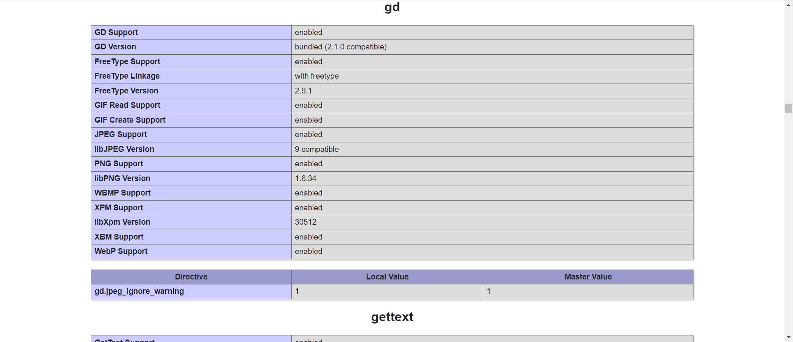

# Сайт на основе MVC
Практическая работа из 24 модуля на курсе Skillfactory &ndash; PHPDEV.

## Содержание работы

* Воспроизведена MVC-архитектура согласно полученным знаниям, на примере сайта визитки.

* В приложении реализовано несколько статических страниц (“Главная», «Портфолию», «Контакты», «Услуги»).

* Подключен пакет php-GD, ниже скрин о его подключении (phpinfo):

## Используемые технологии

* HTML

* CSS

* PHP